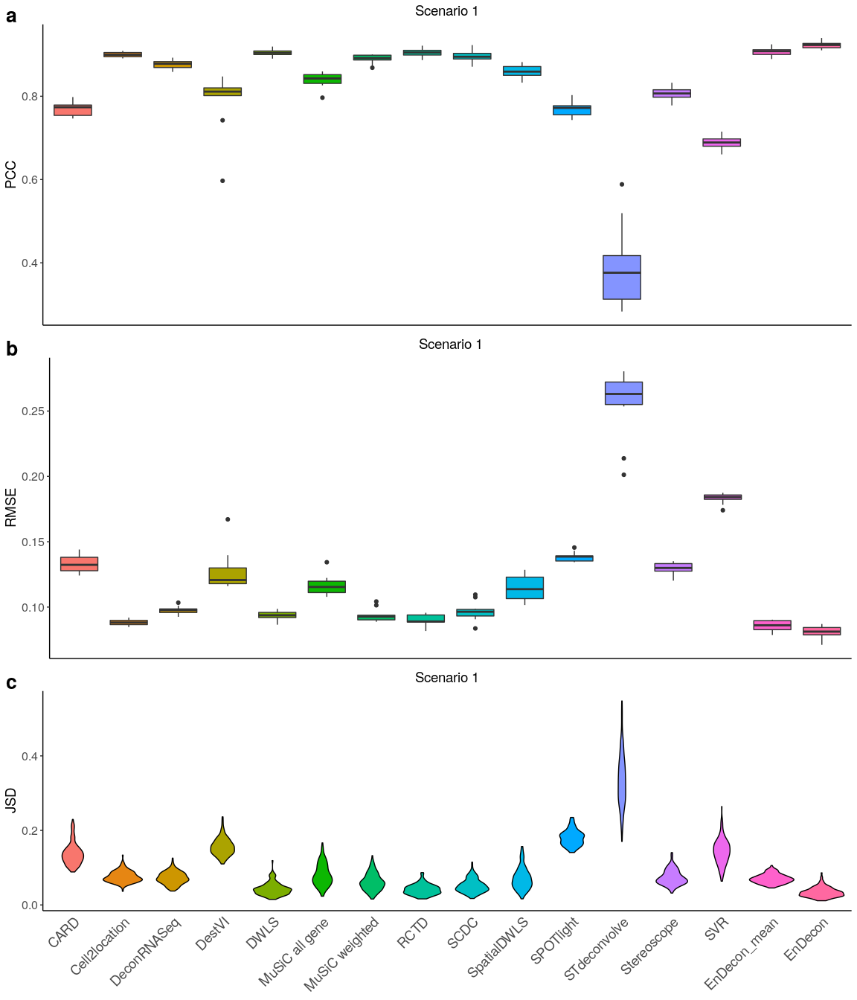
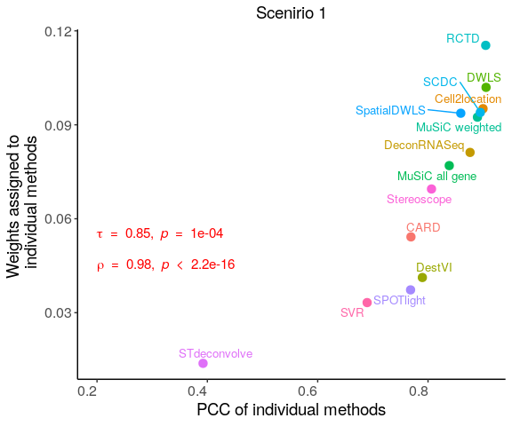

# Simulation

Here, we give a tutorial of simulation analysis, which correspond
Scenario 1 of our article.

# Generate simulation data

The SRT data and scRNA-seq dataset are generated from the same tissue to
examine the accuracy of EnDecon on cell type deconvolution. We select a
publicly available human pancreas dataset from scRNA-seq protocol inDrop
(named Baron), consisting of 7,742 cells and 6 common cell types
(acinar, beta, delta, ductal, alpha and gamma) \[18\]. Following \[1,
2\], we divide the scRNA-seq dataset equally into two groups: one group
is used to generate spot-based gene expression data to mimic the outcome
of gene expression dataset from STR, and the other one is considered as
the reference scRNA-seq dataset with annotated cell type labels. We
generate SRT data with 175 spots. To mimic the actual spots coordinates
as much as possible, spot coordinates are set according to scenario 3.

We provide the generated simulation data in the folder
“./simulation/data/sim_pbac_seg_muraro_wang.Rds”

# Running deconvolution methods

Due to long time requirement of running base individual methods, we
directly provide the results “./simulation/run
methods/Results.dec.ori.all.RData”.

Alternatively, if the users want to run the methods on your computer,
just run the R script “./simulation/run
methods/PBAC_batch_experiment.R”.

# Visualization

Visualization the comparison of methods in terms of PCC, RMSE and JSD

``` r
require(knitr)
knitr::opts_knit$set(root.dir = "..")
```

``` r
suppressMessages(library(ggplot2))
# please set the path of EnDecon
sim_pbac_seg_muraro_wang <- readRDS("./simulation/data/sim_pbac_seg_muraro_wang.Rds")
method_index <- c(1, 2, 3, 4, 5, 8, 7, 9, 10, 11, 12, 14, 13, 6, 15, 16)
method_names <- c("CARD", "Cell2location", "DeconRNASeq", "DestVI", "DWLS", "MuSiC all gene",
                  "MuSiC weighted", "RCTD", "SCDC", "SpatialDWLS", "SPOTlight",
                  "STdeconvolve", "Stereoscope", "SVR", "EnDecon_mean", "EnDecon")
# load results of individual methods
load("./simulation/run methods/Results.dec.ori.all.RData")
plot.list.ori <- list()
#### calculate PCC and RMSE
library(philentropy)
library(cowplot)
niter <- 10
R_square_ori = matrix(NA, nrow = niter, ncol = length(method_index))
RMSE_ori = matrix(NA, nrow =niter, ncol = length(method_index))
cell_type_ori <- sim_pbac_seg_muraro_wang$ref_data$cell_type
for (k in 1:length(method_index)) {
  for (i in 1:niter) {
    temp1 <- Results.dec.ori[[i]][[1]][[k]][,cell_type_ori]
    temp2 <- sim_pbac_seg_muraro_wang$spot_data[[i]]$sim_spots_pro[,cell_type_ori]
    R_square_ori[i, k] <- cor(c(temp1), c(temp2), method = "pearson")
    RMSE_ori[i, k] <- sqrt(mean((temp2- temp1)^2))
  }
}
colnames(R_square_ori) = method_names
colnames(RMSE_ori) = method_names
sort(apply(R_square_ori,2, median))
```

    ##   STdeconvolve            SVR      SPOTlight           CARD    Stereoscope         DestVI 
    ##      0.3762394      0.6890767      0.7721118      0.7737312      0.8067637      0.8111848 
    ## MuSiC all gene    SpatialDWLS    DeconRNASeq MuSiC weighted           SCDC  Cell2location 
    ##      0.8427820      0.8591949      0.8781457      0.8916943      0.8949104      0.8997568 
    ##           DWLS           RCTD   EnDecon_mean        EnDecon 
    ##      0.9042173      0.9051446      0.9082985      0.9231870

``` r
sort(apply(RMSE_ori,2, median))
```

    ##        EnDecon   EnDecon_mean  Cell2location           RCTD MuSiC weighted           DWLS 
    ##     0.08120677     0.08605716     0.08815056     0.08895774     0.09270195     0.09372479 
    ##           SCDC    DeconRNASeq    SpatialDWLS MuSiC all gene         DestVI    Stereoscope 
    ##     0.09641930     0.09762302     0.11370872     0.11536349     0.12071765     0.12994434 
    ##           CARD      SPOTlight            SVR   STdeconvolve 
    ##     0.13233727     0.13863599     0.18416501     0.26309213

``` r
df1_box <- data.frame(PCC = c(R_square_ori),
                      RMSE = c(RMSE_ori),
                      Method = factor(rep(method_names,each=niter),
                                      levels = method_names))
error_box = ggplot(df1_box, aes(x = Method , y = PCC,
                                fill = Method))+
  geom_boxplot()+
  theme_classic()+
  labs(y="PCC",x=" ", title = "Scenario 1")+
  theme(
    axis.text.x.bottom = element_blank(),
    axis.text.y.left = element_text(size = 12),
    axis.title.x = element_blank(),
    axis.title.y = element_text(size = 14),
    axis.ticks.x = element_blank(),
    plot.title = element_text( size=14,hjust = 0.5),
    legend.position = "none",
    panel.grid.major = element_blank(),
    panel.grid.minor = element_blank(),
    panel.border = element_blank(),
    axis.line = element_line(colour = "black")
  )
# error_box
plot.list.ori[[1]] <- error_box
RMSE_box = ggplot(df1_box, aes(x = Method , y = RMSE,
                               fill = Method))+
  geom_boxplot()+
  theme_classic()+
  labs(y="RMSE",x=" ", title = "Scenario 1")+
  theme(
    axis.text.x.bottom = element_blank(),
    axis.text.y.left = element_text(size = 12),
    axis.title.x = element_blank(),
    axis.title.y = element_text(size = 14),
    axis.ticks.x = element_blank(),
    plot.title = element_text( size=14,hjust = 0.5),
    legend.position = "none",
    panel.grid.major = element_blank(),
    panel.grid.minor = element_blank(),
    panel.border = element_blank(),
    axis.line = element_line(colour = "black")
  )
plot.list.ori[[2]] <- RMSE_box
## plot the JSD
library(philentropy)
source("./simulation/plot/get_jsd.R")
nspot <- nrow(Results.dec.ori[[1]][[1]][[1]])
jsd = matrix(0,nrow = nspot, ncol = length(method_names))
colnames(jsd) = method_names
for (k in 1:length(method_names)) {
  jsd_mat = matrix(0,nrow = nspot, ncol = niter)
  for (i in 1:niter) {
    temp1 <- Results.dec.ori[[i]][[1]][[k]][,cell_type_ori]
    temp2 <- sim_pbac_seg_muraro_wang$spot_data[[i]]$sim_spots_pro[,cell_type_ori]
    jsd_mat[,i] = get_jsd(temp1, temp2)
  }
  jsd [,k] = apply(jsd_mat,1,mean)
}
quanjsd = apply(na.omit(jsd),2, quantile)
rownames(quanjsd)
```

    ## [1] "0%"   "25%"  "50%"  "75%"  "100%"

``` r
colnames( quanjsd) = method_names
sort(quanjsd[3,] )
```

    ##        EnDecon           DWLS           RCTD           SCDC MuSiC weighted    SpatialDWLS 
    ##     0.03163385     0.03986748     0.04013407     0.04800351     0.05841832     0.06471089 
    ##   EnDecon_mean    Stereoscope    DeconRNASeq  Cell2location MuSiC all gene           CARD 
    ##     0.06917392     0.06950673     0.07144405     0.07428282     0.07492433     0.13404344 
    ##            SVR         DestVI      SPOTlight   STdeconvolve 
    ##     0.14230239     0.15506718     0.18113978     0.33023884

``` r
meanjsd  = apply(jsd,2, mean)
names(meanjsd) = method_names
sort(meanjsd)
```

    ##           RCTD           SCDC MuSiC weighted   EnDecon_mean    SpatialDWLS    DeconRNASeq 
    ##     0.04134951     0.05121751     0.06181265     0.07019106     0.07103115     0.07203775 
    ##    Stereoscope  Cell2location MuSiC all gene           CARD            SVR         DestVI 
    ##     0.07390774     0.07559990     0.08039273     0.13687375     0.14316583     0.15604694 
    ##      SPOTlight   STdeconvolve 
    ##     0.18043121     0.33529302

``` r
JSD_en <- data.frame(JSD = c(jsd),
                     lable = factor(rep(method_names, each = nspot),
                                    levels = method_names))

jsd.ggplot <-ggplot(JSD_en, aes(x =lable, y = JSD))+
  geom_violin(col="black") + aes(fill = lable)+
  labs(title="Scenario 1", x="Method",
       y="JSD") + theme_classic()+
  theme(
    axis.text.x.bottom = element_text(size = 14,hjust = 1,angle =45),
    axis.text.y.left = element_text(size = 12),
    axis.title.x = element_blank(),
    axis.title.y = element_text(size = 14),
    axis.ticks.x = element_blank(),
    plot.title = element_text( size=14,hjust = 0.5),
    legend.position = "none",
    panel.grid.major = element_blank(),
    panel.grid.minor = element_blank(),
    panel.border = element_blank(),
    axis.line = element_line(colour = "black")
  )
# jsd.ggplot
plot.list.ori[[3]] <- jsd.ggplot
names(plot.list.ori) <- c("ori_PCC", "ori_RMSE", "ori_JSD")
# save(plot.list.ori, file = "ggplot.ori.evaluation.RData")

pfig2_temp <- c(plot.list.ori[1], plot.list.ori[2], plot.list.ori[3])
suppressWarnings(pfig2 <- cowplot::plot_grid(  plotlist = pfig2_temp, labels = letters[1:3], nrow = 3, label_size = 20))
print(pfig2)
```



Visualization of the dotplot between PCC and weight learned by EnDecon

``` r
load("./simulation/run methods/list_w_ensemble_ori.RData")
w.mean <- Reduce("+", list_w_ensemble_ori)/length(list_w_ensemble_ori)
correlation.mean <- apply(R_square_ori,2, mean)[1:length(w.mean)]
data_bar = data.frame(Method = factor(names(w.mean),levels = names(w.mean)),
                      weight_est = w.mean,
                      PCC = correlation.mean)
suppressMessages(library(ggpubr))
library(ggrepel)
p2 = ggplot(data_bar , aes(x = PCC , y = weight_est, color = factor(Method))) +
  geom_point(size = 3) +
  theme_classic() +
  labs(y="Weights assigned to \n individual methods",
       x="PCC of individual methods",title = "Scenirio 1") +
  theme(axis.text.x = element_text(size = 12, hjust = 1),
        axis.text.y.left = element_text(size = 12),
        axis.title.y = element_text(size = 14),
        axis.title.x = element_text(size = 14),
        panel.border = element_blank(),
        legend.position = "none",
        axis.text.y = element_text(size = 14),
        plot.title = element_text(hjust = 0.5, size = 14)) +
        geom_text_repel(aes(label = Method), size = 3.5) +
        stat_cor(method='pearson', cor.coef.name = "tau", size = 4,
        label.x = 0.2, label.y = 0.055,color='red') +
        stat_cor(method='spearman', cor.coef.name = 'rho', size = 4,
        label.x = 0.2, label.y = .045,color='red')

print(p2)
```



# Other experiments

Similar to the aforementioned, the users could run the codes in
“./simulation/plot” R scripts to generate the results of Scenario 2.
